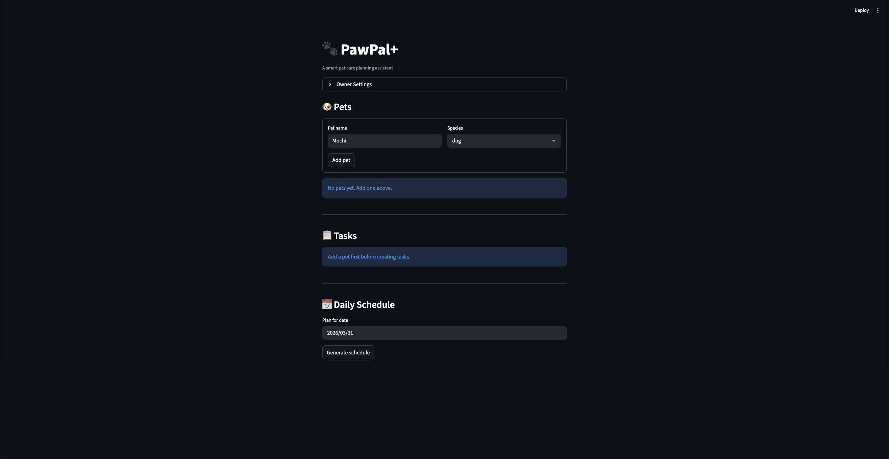

# PawPal+ (Module 2 Project)

**PawPal+** is a Streamlit app that helps a pet owner plan daily care tasks for their pets. It considers priority, time, and how many minutes you actually have — then builds a smart schedule.

## Demo

<a href="/course_images/ai110/pawpal_image.png" target="_blank"></a>

## Features

- **Owner + pet management** — add pets, configure your available time for the day
- **Task creation** — set title, duration, priority, scheduled time (HH:MM), date, and frequency (once / daily / weekly)
- **Priority + time sorting** — the scheduler orders tasks by priority (high first), then by scheduled time within each level
- **Time budget** — fits as many tasks as possible without exceeding your available minutes
- **Filtering** — filter the task list by pet name or completion status
- **Recurring tasks** — marking a daily or weekly task complete auto-creates the next occurrence
- **Conflict detection** — flags a warning when multiple tasks are booked at the same time slot
- **Mark complete** — complete tasks from the UI; recurring ones automatically roll forward
- **Plan explanation** — expandable section explains why the schedule was built the way it was

## Final UML

The final class diagram is in [`uml_final.md`](uml_final.md) (Mermaid format). Paste the contents into the [Mermaid Live Editor](https://mermaid.live) to render it.

Four classes: `Task`, `Pet`, `Owner`, and `Schedule`. Owner has Pets, Pets have Tasks, and Schedule pulls tasks from Owner's pets to build a prioritized, time-constrained plan.

## Testing PawPal+

Run the test suite:

```bash
python -m pytest
```

20 tests covering:

- **Task basics** — completion status, recurring task generation (daily/weekly), one-time tasks returning no follow-up
- **Pet management** — adding tasks increases the pet's task count
- **Scheduling logic** — priority ordering, time budget constraints, excluding completed tasks, chronological sorting
- **Filtering** — by pet name, by completion status, nonexistent pet returns empty
- **Conflict detection** — same-time conflicts (same pet and cross-pet), no false positives when times differ
- **Edge cases** — pet with no tasks, owner with no pets, tasks on wrong date, all tasks exceeding budget

**Confidence Level: ⭐⭐⭐⭐ (4/5)** — happy paths and key edge cases are well covered. The main gap is overlap-based conflict detection (e.g., a 30-min task at 07:00 vs a task at 07:15) which we intentionally skip in favor of simplicity.

## Getting started

### Setup

```bash
python -m venv .venv
source .venv/bin/activate  # Windows: .venv\Scripts\activate
pip install -r requirements.txt
```

### Run the app

```bash
streamlit run app.py
```

### Run tests

```bash
python -m pytest
```
