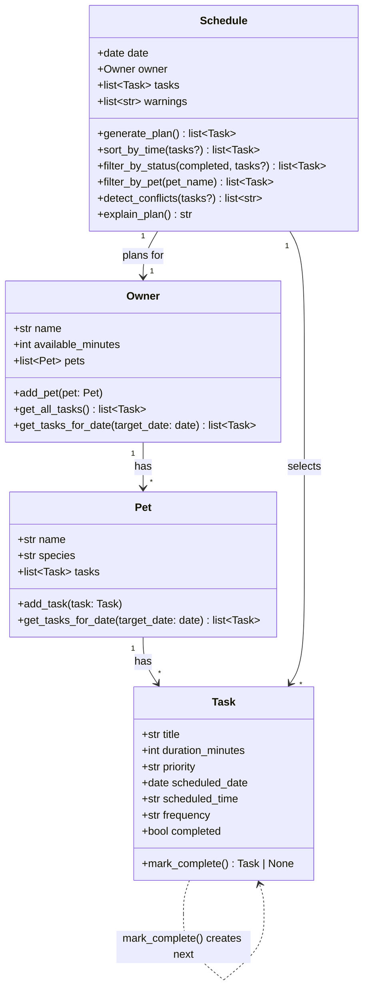

```mermaid
classDiagram
    class Task {
        +str title
        +int duration_minutes
        +str priority
        +date scheduled_date
        +str scheduled_time
        +str frequency
        +bool completed
        +mark_complete() Task | None
    }

    class Pet {
        +str name
        +str species
        +list~Task~ tasks
        +add_task(task: Task)
        +get_tasks_for_date(target_date: date) list~Task~
    }

    class Owner {
        +str name
        +int available_minutes
        +list~Pet~ pets
        +add_pet(pet: Pet)
        +get_all_tasks() list~Task~
        +get_tasks_for_date(target_date: date) list~Task~
    }

    class Schedule {
        +date date
        +Owner owner
        +list~Task~ tasks
        +list~str~ warnings
        +generate_plan() list~Task~
        +sort_by_time(tasks?) list~Task~
        +filter_by_status(completed, tasks?) list~Task~
        +filter_by_pet(pet_name) list~Task~
        +detect_conflicts(tasks?) list~str~
        +explain_plan() str
    }

    Owner "1" --> "*" Pet : has
    Pet "1" --> "*" Task : has
    Schedule "1" --> "1" Owner : plans for
    Schedule "1" --> "*" Task : selects
    Task ..> Task : mark_complete() creates next
```
